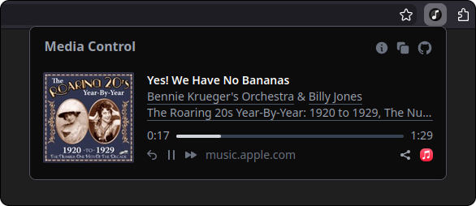
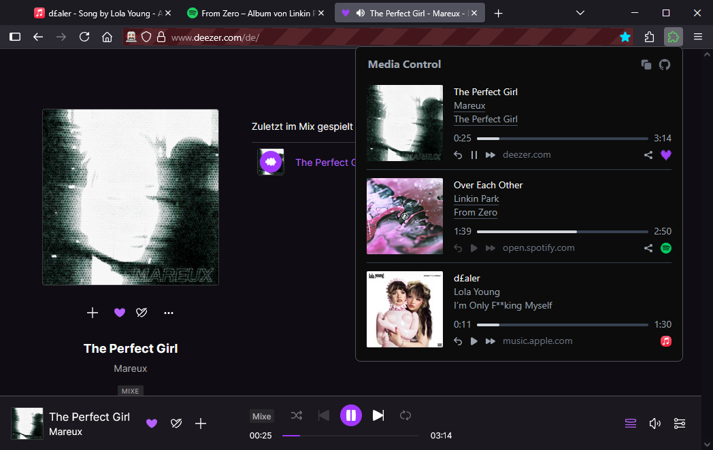
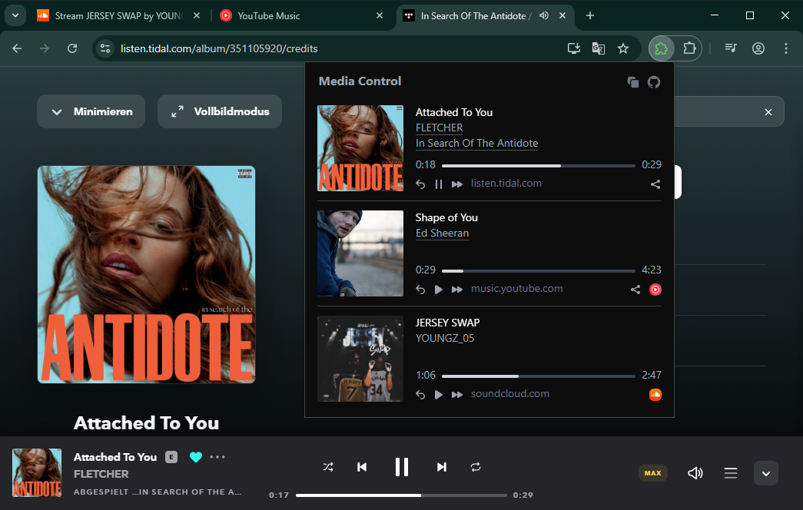
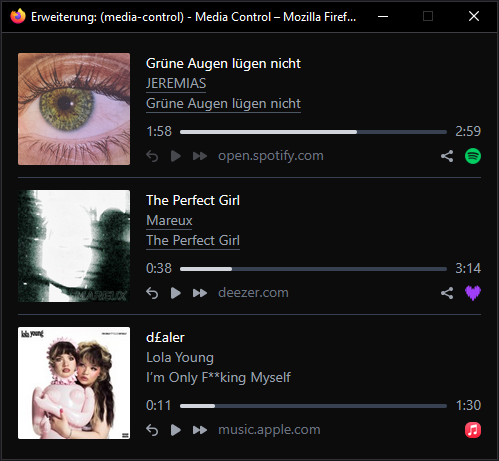

# Media Control Extension

View and control all media that is playing in your browser.

Displays all available metadata, extracts links to track, artist and album pages from each website and offers media controls like play, pause, skip and rewind, if the web page supports it.



[](https://addons.mozilla.org/firefox/addon/media-control-extension/)

*Available on the Chrome Web Store soon browsers soon. Download it manually for Chrome [here](https://github.com/ungive/media-control-extension/releases).*

## Features

- Detects media on almost all websites and major services like Spotify, Deezer, TIDAL, YouTube Music, Apple Music, SoundCloud and YouTube. It works generically without any hardcoding that breaks easily
- Extracts links to track, artist and album pages directly from the website, if they are available on the page. You can quickly navigate to the artist's or album page. This does not make any additional API requests
- You can control the media (play, pause, skip, rewind), if the page has a media element (most do)
- Does not break with Spotify, unlike many other extensions that offer similar functionality
- You can create a pop-out window that continuously shows what's currently playing

Do you have an idea for a new feature? [Suggest it!](https://github.com/ungive/media-control-extension/issues)

## Screenshots







## Development

### Quick start

```sh
$ git clone https://github.com/ungive/media-control-extension
$ cd media-control-extension
$ pnpm install
$ pnpm dev:firefox
$ pnpn dev  # Chrome
```

### Developing inside a Docker container

These steps are for [VSCodium](https://vscodium.com/) with the [Open Remote - SSH](https://open-vsx.org/vscode/item?itemName=jeanp413.open-remote-ssh) extension on Linux:

```sh
$ git clone https://github.com/ungive/media-control-extension
$ cd media-control-extension
$ bash ./dev-container.sh --start
# Inside the container:
% pnpm install
% pnpm wxt --host 0.0.0.0 -b firefox  # Firefox
% pnpm wxt --host 0.0.0.0 -b chrome  # Chrome
```

The first command creates and starts (or restarts) a dev container and opens VSCodium. After installing dependencies and starting WXT, open your host's browser and load the extension from the `.output` directory. If your browser is installed via Flatpak, you need to give the browser read/write permission to the `.output` directory. The extension should now auto-reload and you have a fully working development environment.

If you want to make commits inside the container (run this outside the container):

```sh
$ git config --local user.name "$(git config --global --get user.name)"
$ git config --local user.email "$(git config --global --get user.email)"
```

You'll have to push changes outside the container.

To erase the container:

```sh
$ bash ./dev-container.sh --erase
```

## Copyright

Copyright (c) 2025-2026 Jonas van den Berg  
This code is source-available only at this time, until it is published on all major stores.  
All rights reserved.
